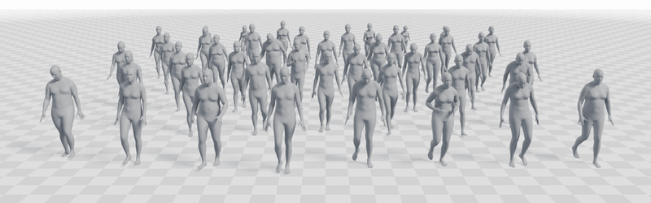
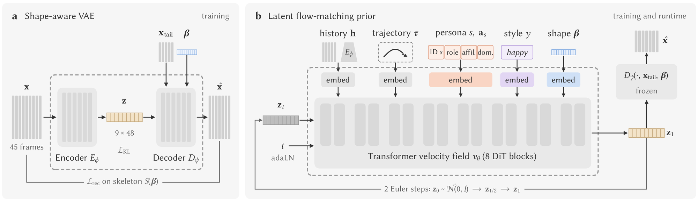
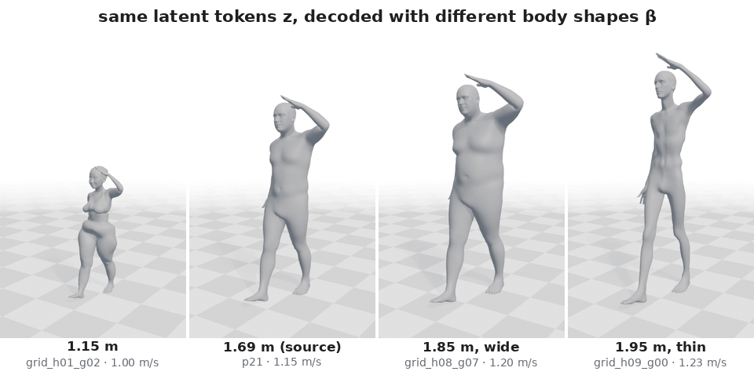
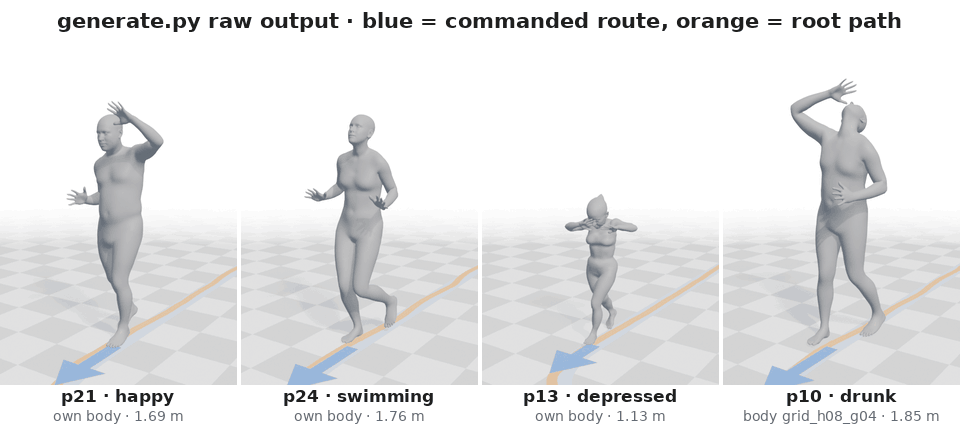
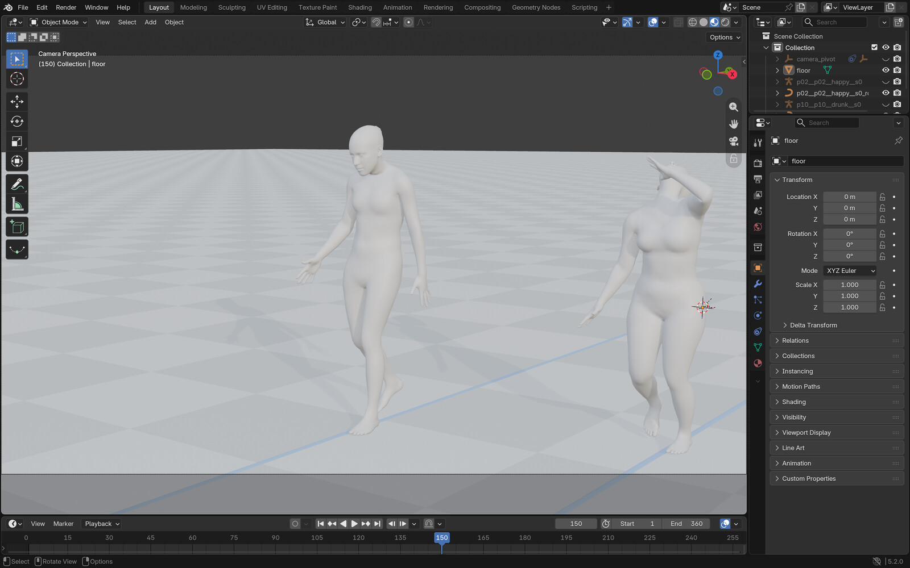
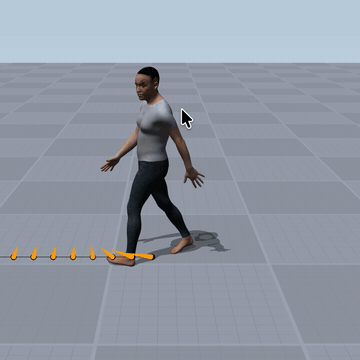
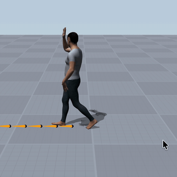
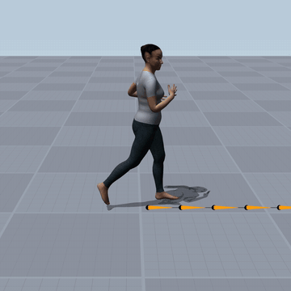
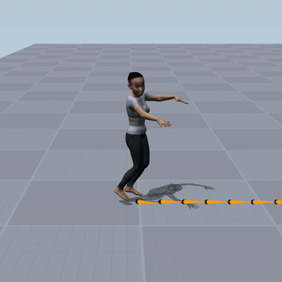

# MotionPersona: Real-Time Locomotion Control across Personas, Bodies, and Styles

<p align="center">
  <a href="https://motionpersona25.github.io/"><b>Homepage</b></a> ·
  <a href="https://arxiv.org/abs/2506.00173"><b>arXiv</b></a> ·
  <a href="https://huggingface.co/spaces/myshi/MotionPersona-Viewer"><b>Data Preview</b></a> ·
  <a href="https://github.com/AIGAnimation/MotionPersona"><b>Code</b></a> ·
  <a href="https://huggingface.co/myshi/MotionPersona_V1"><b>Model</b></a> ·
  <a href="https://huggingface.co/datasets/myshi/MotionPersonaX"><b>Dataset (MotionPersonaX)</b></a>
</p>

<p align="center"></p>
<p align="center"><em>Forty-four characters generated by one model, each conditioned on the persona and body shape of
one captured participant, following the same straight path; the formation spreads because longer legs travel
faster.</em></p>

A generative locomotion controller with three controls: a captured motion **persona** (who is moving), a target
**body** (an SMPL-X body shape that carries the motion) and a performed **style** (how the character is moving), under
a trajectory command. One model covers 44 captured personas, a wide family of SMPL-X bodies and nine styles, and runs
at 27 ms per block on two threads of a laptop CPU.

This repository contains the training code of both stages, the released model, offline generation, the evaluation
protocol of the paper and an interactive realtime demo.

## How it works

<p align="center"></p>

Motion is generated block by block: every block predicts the next 45 frames (1.5 s at 30 fps) from the last frames
already played, and only the first few of them are committed (12 in the offline protocol, 3 to 12 in the realtime
demo) before the next block is generated, so the character reacts to new commands within a fraction of a second. Each block passes through
two stages, trained one after the other.

**Stage 1: shape-aware VAE (the codec, panel a).** The encoder `E` compresses a 45-frame block `x` into a few latent
tokens `z` (9 tokens of 48 dimensions). The decoder `D` turns `z` back into joint rotations, root motion and foot
contacts **on a given body**: besides `z` it receives the body's 10 SMPL-X shape coefficients `β` and the last frames
of the motion so far (`x_tail`, the last 5 frames, so consecutive blocks join without a seam). It is trained with reconstruction,
forward-kinematics and contact losses evaluated on the skeleton `S(β)` of that body. The decoder therefore owns
everything that is geometry: where the feet land, how far a step reaches, how the pelvis and trunk sit on this body.
The latent `z` keeps what the motion *is*, and `β` decides how it is realised. Decoding one `z` sequence on different
bodies gives the same motion carried by each of them:

<p align="center"></p>
<p align="center"><em>One sequence of latent tokens (p21, happy, sampled by the prior on its own body) decoded on four
SMPL-X bodies. Timing and gestures are shared; stride, speed (1.00 to 1.23 m/s) and posture follow the body.</em></p>

**Stage 2: latent flow-matching prior (panel b).** With the codec frozen, a transformer (8 DiT blocks) learns to
generate the next block's latent tokens `z`. It is conditioned on the motion history (one token from the codec
encoder), the commanded trajectory (45 future positions and facings), the persona (a learned performer-ID token plus
role, affiliation and dominance attribute tokens), the style, and the target body shape `β`. Sampling takes two Euler
steps from Gaussian noise, after which the frozen decoder renders the tokens on the target body. The prior chooses
*which* motion this persona, in this style, would perform for this command on this body, in a space small enough
for a real-time budget; the decoder fits the result to the body.

## Installation

```bash
git clone https://github.com/AIGAnimation/MotionPersona.git && cd MotionPersona
python -m venv .venv && source .venv/bin/activate      # Python 3.10-3.12
pip install -r requirements.txt                        # for CUDA, install the torch wheel that matches your driver first
```

All commands run from the repository root. The released model
([myshi/MotionPersona_V1](https://huggingface.co/myshi/MotionPersona_V1), 175 MB) is downloaded into `checkpoints/`
on first use, or with `python scripts/download_weights.py` (behind a firewall: `HF_ENDPOINT=https://hf-mirror.com`).

## Generate motion

```bash
python generate.py --persona p02 --style happy                           # p02 on its own body, 20 s
python generate.py --persona p02,p10 --style neutral,drunk --body own,grid_h08_g04 --seconds 30 --seeds 0,1
python generate.py --persona all --style all --body 72 --seconds 60      # every persona x style on one body
```

A case is (persona, style, body, seed). Every case starts from the same canonical walking history placed on its body
and follows a world-fixed, time-indexed trajectory scaled by the body's leg length; the default is the one-minute
evaluation route of the paper (walk, fast walk, turns, run, arc, sharp turn, stop, sidestep, backward walk, meander,
U-turn). Generation is block-wise with the paper's runtime schedule: two Euler steps per block, 12 frames committed per
block after a 2-frame cross-fade with the previous block, the committed frames becoming the next block's history. The
output is the raw model output (no foot locking or other post-processing) and is deterministic for a given seed,
device and batch size.

<p align="center"></p>
<p align="center"><em>Raw <code>generate.py</code> output on the evaluation route (seed 0), rendered on SMPL-X meshes:
persona · style · body. Blue arrow: the command; orange line: the root path.</em></p>

| option | meaning |
|---|---|
| `--persona` | performer IDs `p01`..`p44`, comma-separated, or `all` |
| `--style` | `angry depressed fear happy neutral bigstep drunk swimming twofootjump`, comma-separated, or `all` |
| `--body` | `own` (the persona's captured body), a body id or name from `data/bodies/bodies.csv` (`p01`..`p44`, `b15`/`b27`/`b33`/`b34`, synthetic `grid_h<0-9>_g<0-7>`: height step x girth step) |
| `--route` | `eval` (default), `video_straight` (straight walk with speed changes), `switch` (walk-run-walk), or a route `.npz` |
| `--seconds`, `--seeds` | length (up to 60 s on `eval`) and noise seeds |
| `--hop`, `--blend`, `--steps`, `--guidance` | block schedule (defaults = the paper), history guidance weight (1 = off) |
| `--device` | `cuda` if available, else `cpu` (a 20 s clip takes a few seconds on a laptop CPU) |

Outputs in `outputs/`: `<persona>__<body>__<style>__s<seed>.bvh` (30 fps, centimetres) and a `.npz` with the local
joint quaternions (wxyz), root positions (metres), predicted foot contacts, skeleton offsets, betas and the commanded
trajectory (`cmd_xz_m`, `cmd_speed_mps`, `cmd_heading`, `cmd_facing`).

### Looking at the results

The BVH files open in any BVH viewer. For a quick preview, `scripts/visualize.py` renders them as stick figures
(blue: commanded route, orange: root path, red: feet the model marks as in contact):

```bash
python scripts/visualize.py outputs/p02__p02__happy__s0.bvh                     # -> outputs/p02__p02__happy__s0.mp4
python scripts/visualize.py outputs/p02__*.bvh -o p02.gif --seconds 10          # several clips side by side
```

To see the motion on SMPL-X bodies, `scripts/blender_scene.py` builds a Blender scene from the `.npz` outputs: one
animated SMPL-X body per clip (shaped by its betas and skinned to an armature), a floor, a light, a camera that follows
the first character, and the commanded route. It runs inside Blender (4.x / 5.x) and needs the SMPL-X model file
(`SMPLX_NEUTRAL.npz`, see [Realtime demo](#realtime-demo)); without `--smplx` it uses stick figures.

```bash
blender --python scripts/blender_scene.py -- outputs/p02__p02__happy__s0.npz --smplx /path/to/SMPLX_NEUTRAL.npz     # opens Blender, press play
blender -b --python scripts/blender_scene.py -- outputs/*.npz --smplx /path/to/SMPLX_NEUTRAL.npz -o outputs/scene.blend
```

The saved `.blend` opens directly in Blender, on any machine and without the SMPL-X file or this script: it starts
looking through the camera, the timeline covers the clip at 30 fps, and **Space** plays it. (It contains SMPL-X
meshes, so share it only as the SMPL-X license allows.)

<p align="center"></p>
<p align="center"><em><code>outputs/scene.blend</code> opened in Blender 5.2: p02 · happy and p10 · drunk with their
commanded routes (blue), ready to play.</em></p>

The BVH files also import directly (*File > Import > Motion Capture (.bvh)*, scale 0.01, since they are in centimetres); their skeleton is the
SMPL-X body skeleton of the chosen body.

### Foot locking

All results in our videos and in this README are raw model output, without foot IK. Foot locking is available as a
post-process: toe contact locking with two-bone leg IK, following Daniel Holden's
[Inverse Kinematics and Foot Locking](https://theorangeduck.com/page/inverse-kinematics-foot-locking)
(`utils/foot_lock.py`). `python generate.py ... --foot-lock runtime` additionally writes `<stem>.footlock.bvh`
(`runtime` = the causal lock used in the realtime demo, `offline` = a solve over the whole clip); in the realtime demo,
**L** toggles it.

## Realtime demo

An interactive scene: a trajectory controller turns keyboard / gamepad input into the 45-frame trajectory plan, the
model generates the motion chunk by chunk in a background thread, and persona, style and body (10 shape sliders) can
be changed at any time.

<table>
  <tr>
    <td align="center" width="25%"></td>
    <td align="center" width="25%"></td>
    <td align="center" width="25%"></td>
    <td align="center" width="25%"></td>
  </tr>
  <tr>
    <td align="center"><sub>steering with the keyboard</sub></td>
    <td align="center"><sub>switching the style (swimming)</sub></td>
    <td align="center"><sub>reshaping the body with the sliders while walking</sub></td>
    <td align="center"><sub>the same persona and style on the new body</sub></td>
  </tr>
</table>
<p align="center"><em>Screen captures of <code>realtime_demo.py</code>, one persona throughout, raw model output.</em></p>

```bash
python3.13 -m venv .venv_rt && source .venv_rt/bin/activate     # 3.12 also works on Linux / Windows
# the renderer: ai4animationpy (CC BY-NC 4.0) at a fixed commit + our patch (forward-pipeline textures, ground grid, GUI)
git clone https://github.com/facebookresearch/ai4animationpy.git
cd ai4animationpy && git checkout bfb5866681f7ea6dac9984be05181de5955eb48b
git apply ../realtime/patch/ai4animationpy.patch && pip install -e . && cd ..
pip install -r requirements_realtime.txt
# the SMPL-X body model (not redistributed): register at https://smpl-x.is.tue.mpg.de, download SMPLX_NEUTRAL.npz
export SMPLX_NPZ=/path/to/SMPLX_NEUTRAL.npz

python realtime_demo.py                                  # p02 / neutral on the average body
python realtime_demo.py --subject p10 --style happy --body p10
python realtime_demo.py --device cuda --compile          # CUDA graphs on an NVIDIA GPU
python realtime_demo.py --help                           # every option
```

The first run builds the skinned body mesh from the SMPL-X model (`realtime/assets/smplx_neutral.glb`, untextured;
set `SMPLX_TEXTURE=/path/to/texture.png` to use an SMPL-X texture).

Controls: **WASD** / left stick move, **Shift** / L3 run, **F** lock the facing (then A/D strafe, S walks backward),
**Q/E** turn the facing, right-mouse drag sets it; **[ ]** style, **, .** persona, **B** morph to the persona's own
body, the 10 **beta sliders** on the right morph the body, **M** model on/off, **R** restart the stream, **L** foot
lock (display only), **U** panels, **H** HUDs.

Scripted and headless use (no window; a fixed virtual clock, reproducible with `--seed`):

```bash
python realtime_demo.py --headless --seed 0 --script scripts/demo_walk.json --export outputs/stream
```

`scripts/demo_walk.json` walks, turns right, switches style, persona and body, and stops; the script format is
documented at the top of `realtime/stream_io.py`. `--export` writes the played stream (`*.motion.npz`, `*.traj.npz`,
`events.json`; the events file replays with `--script`).

## Training

Both stages (see [How it works](#how-it-works)) are trained with Hydra + PyTorch Lightning:

1. **Codec** (`network/vae.py`, `diffusion=vae`): a KL-VAE that encodes a 45-frame future window into 9 latent tokens
   of 48 dimensions (5 frames per token) and decodes them conditioned on the last 5 true frames and the body shape
   (betas), with one learned query per output frame and a residual temporal refine head.
2. **Prior** (`network/latfm.py`, `diffusion=latfm`): flow matching in the frozen codec's token space with a DiT
   denoiser (8 adaLN-Zero blocks x 384). Condition tokens: persona = learned performer-ID token + three typed attribute
   tokens (role / affiliation / dominance, `network/cond_tokens.py`), style = learned token, body = betas token,
   trajectory = 45 translation + 45 orientation tokens, history = one token from the codec encoder over the last 10
   frames (masked with p = 0.15 during training, which enables history guidance at runtime).

### Smoke run on the example data (CPU, under a minute per stage)

```bash
python train.py experiment=example_codec               # -> save/example_codec/
python train.py experiment=example_prior               # -> save/example_prior/ (uses save/example_codec/best.ckpt)
python train.py experiment=example_prior diffusion.vae_ckpt=checkpoints/codec.ckpt   # on the released codec
```

These train a few iterations on the 10 clips of `example_data/sample10` (see its [README](example_data/README.md) for
the on-disk format) and export BVH samples (`save/<run>/samples/*/motion_i.{gt,pred,sample}.bvh`: ground truth,
one-pass prediction, full sampling loop).

### Data preparation

Training uses [MotionPersonaX](https://huggingface.co/datasets/myshi/MotionPersonaX) (328,960 clips: 2,570
MotionPersona takes retargeted onto 128 bodies), converted to the `flat_v1` layout the loader reads (see
`example_data/README.md`). Only the SMPL-X parameter archives are needed (~104 GB); the SMPL-X model files are not.

```bash
hf download myshi/MotionPersonaX --repo-type dataset --local-dir data/MotionPersonaX \
    --include "smpl_skeleton/smpl/*" "smpl_skeleton/shapes/*" manifest.csv bodies.csv
python scripts/prepare_data.py --src data/MotionPersonaX            # -> data/motionpersonax_flat (~190 GB)
```

The conversion streams the archives (nothing is unpacked to disk), is resumable (rerun the same command) and takes
roughly 10-30 minutes on a multi-core machine. `--bodies p02 b27 grid_h05_g03 ... --out <dir>` converts a subset
(same motion order); `--workers N` sets the parallelism. The result is the dataset the released checkpoints were
trained on: same motions, order, foot-contact labels (shipped in `data/motionpersonax_sources.npz`), persona and
style labels, skeletons and normalisation statistics; rotations and positions agree to float32 round-off. Held-out
bodies, takes and persona x body cells (`data/eval/split_v2`) refer to MotionPersonaX body and clip names.
`configs/experiment/codec.yaml` and `prior.yaml` read `data/motionpersonax_flat`; override with `data.path=<dir>`.
Clip frames are used as stored (30 fps nominal), including the 120 source takes whose frame rate was corrected in the
MotionPersona release.

### Full training (the released model)

```bash
torchrun --nproc_per_node=2 train.py experiment=codec                                          # stage 1
torchrun --nproc_per_node=4 train.py experiment=prior diffusion.vae_ckpt=save/codec/best.ckpt  # stage 2
```

| stage | recipe | budget | our hardware |
|---|---|---|---|
| codec | `configs/experiment/codec.yaml` | 60 epochs x 3000 it x 2 ranks x 1024 windows | ~10 h, 2 x RTX 4090 |
| prior | `configs/experiment/prior.yaml` | 100 epochs x 1500 it x 4 ranks x 1024 windows | ~19 h, 4 x RTX 4090 |

Both recipes compose to exactly the configuration stored in the released checkpoints (which keep only the EMA
weights of the prior; training writes full Lightning checkpoints with the EMA shadow). The split
`data/eval/split_v2` holds out 15 bodies, 132 persona x body cells and 744 source takes from training (the codec only
excludes the held-out bodies, `data.split_apply=[bodies]`). The per-rank batch is 1024; changing the number of ranks
changes the effective batch. `resume=last` continues a run from `<run_dir>/last.ckpt`.

A run directory contains `config.yaml` (the resolved config), `log.txt`, `best.ckpt` (lowest training loss after
`trainer.best_after` epochs), `last.ckpt`, `weights_<epoch>.ckpt` every `trainer.save_freq` epochs, TensorBoard logs
under `runtime/` and exported BVH samples under `samples/`. To generate with your own model:
`python generate.py --ckpt save/prior/best.ckpt ...`.

## Evaluation

Reproduces the main quality table of the paper. Run from the repository root; a GPU is recommended for the rollouts.

**1. Reference set** (needs the converted dataset, see [Data preparation](#data-preparation)):

```bash
python scripts/make_eval_refs.py --data data/motionpersonax_flat --no-bvh -o save/eval/reference
python -m evaluation.run_metrics refs --ref save/eval/reference --workers 8
```

The held-out takes (`data/eval/split_v2/heldout_takes.csv`, never seen in training) are written with both halves on
the performer's own body and the reference half on the 16 sweep bodies, the 15 held-out bodies and the other
performers' bodies (about 27k takes, 15 GB); the second command scores them and writes the FPD statistics.

**2. Rollouts** (one minute on the evaluation route with the paper protocol: canonical neutral-walk history on the
test body, two Euler steps per block, 12 frames committed per block after a 2-frame cross-fade, EMA weights, no foot
locking, seeds 0-4):

```bash
for ts in own seen withheld heldout; do
  python scripts/eval_rollout.py --test-set $ts --out save/eval/released/$ts
done
```

`own`: 44 personas x 9 styles on their own body (1,980 rollouts); `seen` / `withheld`: 44 personas on the twelve
training sweep bodies, split by whether the persona x body pairing was seen in training (1,980 / 660); `heldout`: 44
personas on the 15 bodies training never saw (3,300). Use `--ckpt` for another checkpoint, and `--limit` / `--seeds 0`
for a quick check.

**3. Metrics** (per rollout, `<dir>/descriptors.csv`):

```bash
for ts in own seen withheld heldout; do
  python -m evaluation.run_metrics rollouts --dir save/eval/released/$ts --ref save/eval/reference
done
```

**4. Table:**

```bash
python scripts/eval_tables.py --runs ours=save/eval/released --ref save/eval/reference -o save/eval/tab_main.csv
```

| column | paper | meaning |
|---|---|---|
| `fpd_pose` | FPD pose | Fréchet distance between Gaussian fits of root-relative, facing-aligned joint positions (/ leg), rollout vs the held-out reference takes of the same persona, body and style |
| `fpd_contact` | FPD contact | the same on each foot's lowest sole-corner height and horizontal toe speed (/ leg), standardised by their std over the own-body reference takes |
| `toe_jerk_med` | Jerk | median third difference of the toe positions, cm/frame³ |
| `skate` | Skate | horizontal toe speed on contact frames, cm/frame; contact = toe slower than 2 cm/frame within 5 cm of the sole plane (one detector for every method and the data) |
| `iou` | IoU | agreement of the model's contact flags (captured labels for the data) with that detector |
| `pen` | Pen. % | fraction of frames with a sole corner more than 1 cm below the floor (x100 in the paper) |
| `seam_cm` | Seam | joint displacement across a block boundary, cm/frame (`seam_ref_cm` = within a block) |
| `track_cm` | root error | mean horizontal distance between the root and the commanded path |
| `spread_dyn`, `spread_amp` | Spread kept Dyn. / Amp. | per descriptor, the std across the 44 personas of the generated value over the std of their references on the same body, per style; mean over the dynamics descriptors (joint speed, acceleration, jerk, high-frequency energy) and the amplitude descriptors (motion amplitude, knee range, foot clearance, pelvis bob, arm swing); own-body set only |

Rows `ours / <test_set>` are the rows of our method, one per test set. Data rows: `data` gives skate, IoU, Pen. and the
FPD-contact floor (each own-body query take against the reference half); `data_grid` gives the jerk of the held-out
takes on the grid bodies; `data_captured` is the captured own-body motion. Each cell is the mean over the set's
rollouts (std in `<column>_std`). FPD is NaN for the persona x style cells without a reference-half take (20 cells on
the own body).

## Repository layout

```
generate.py               offline generation (block-wise rollout along a route) -> BVH
realtime_demo.py          interactive realtime demo (launcher of realtime/Program.py)
train.py                  training entry point (Hydra config -> Lightning Trainer)
configs/                  config.yaml + groups (data, model, diffusion, loss, continuity, trainer) + experiment/
  experiment/codec.yaml   stage-1 recipe of the released codec
  experiment/prior.yaml   stage-2 recipe of the released prior
  experiment/example_*.yaml   CPU smoke runs on example_data/
network/
  vae.py                  stage-1 codec (encoder, query decoder, temporal refine head)
  latfm.py                stage-2 latent flow-matching module + LatentDiT denoiser
  cond_tokens.py          persona (ID + attributes) and style embeddings
  models.py, fm.py, diffusion.py, lit_module.py   shared token processing, flow-matching / DDPM utilities, base module
  losses.py               reconstruction, forward-kinematics, velocity, foot-contact and seam losses
  callbacks.py            EMA, sample export, DDP sanity checks
data/
  loco_dataset.py         flat_v1 dataset: sliding 55-frame windows (10 history + 45 future), vocabularies
  augment.py              on-GPU featurisation (rotation augmentation, mirroring, 6D rotations, trajectory features)
  samplers.py             subject-balanced sampler, split / hold-out masks
  bodies.py               betas -> skeleton offsets (SMPL-X joint regressor, sole-plane root basis)
  bodies/                 the 128 bodies (48 captured + 80 synthetic): betas, leg lengths
  eval/                   evaluation routes, canonical start history per body, speed caps, split_v2
  skeleton/meta.pkl       the BVH skeleton template
evaluation/               block-wise rollout engine (the paper's evaluation protocol) and metrics
realtime/                 realtime runtime (chunk streamer, trajectory controller, renderer glue, ai4animationpy patch)
utils/                    BVH I/O, rotation / FK utilities, foot locking, weight download
scripts/                  data preparation, evaluation, weight download, sample checks, demo script
example_data/             10 training clips in the on-disk training format (+ BVH exports for viewing)
```

Conventions: 30 fps, Y-up, metres (BVH files in centimetres); 23 joints of the SMPL-X body skeleton; rotations are
local wxyz quaternions with the root carrying the world orientation; `skel_offset[0]` is the pelvis height above the
sole plane.

**Identifiers.** Personas are the 44 annotated participants of MotionPersona, `p01`–`p44`; four captured bodies
without persona annotation are `b15`, `b27`, `b33`, `b34`; synthetic bodies are `grid_h<height>_g<girth>`. Persona
attributes (role, affiliation, dominance) and style labels are the dataset's annotations.

## License

The code and the model weights are released under [CC BY-NC 4.0](LICENSE) for non-commercial and research purposes
only. For commercial use, contact [myshi@cs.hku.hk](mailto:myshi@cs.hku.hk) and [taku@hku.hk](mailto:taku@hku.hk) to
obtain a commercial license.

Third-party components:
* **SMPL-X** (https://smpl-x.is.tue.mpg.de): all bodies are SMPL-X skeletons parameterised by 10 shape coefficients.
  The SMPL-X model files and textures are not included; the realtime demo needs `SMPLX_NEUTRAL.npz` under the SMPL-X
  license. `data/bodies/joint_regressor.npz` is the linear betas-to-joint-positions map derived from SMPL-X.
* **ai4animationpy** (https://github.com/facebookresearch/ai4animationpy, CC BY-NC 4.0) renders the realtime demo; we
  ship only a patch against its public repository (`realtime/patch/`).

## Citation


If you use the data, code, or any module from this repo, please cite the original paper:

```bibtex
@article{shi2025motionpersona,
  title={MotionPersona: Characteristics-aware Locomotion Control},
  author={Shi, Mingyi and Liu, Wei and Mei, Jidong and Tse, Wangpok and Chen, Rui and Chen, Xuelin and Komura, Taku},
  journal={arXiv preprint arXiv:2506.00173},
  year={2025}
}
```
